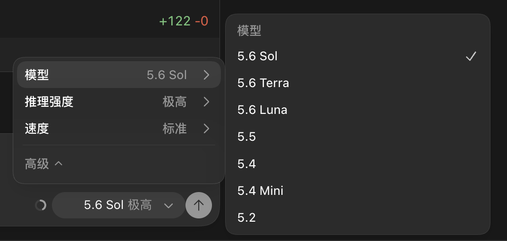

# ChatGPT App Local Feature Patcher

[简体中文](README.zh-CN.md)

This tool safely manages two local patches for problems that can affect Codex sessions signed in with an API key:

1. **Keep newly released models up to date:** fixes the delay where newly released models may not appear promptly in the Codex model picker when signed in with an API key. Models returned by the provider with `visibility=list` can appear automatically, without hard-coding any GPT model IDs.
2. **Force Fast mode switching:** fixes the missing Fast mode menu in API-key sessions. When the selected model declares support for the corresponding service tier, the patch forces the Standard/Fast (Priority) switch to be available.

> [!WARNING]
> This project modifies a locally installed third-party desktop application. Every real write creates a hash-verified backup first, but the patched macOS App must use a local ad-hoc signature and will no longer pass Gatekeeper assessment as an official OpenAI build.

## Screenshots

| Newly released models in the picker | Forced Fast mode switching |
| --- | --- |
|  |  |

Both screenshots were captured from a locally verified Codex session signed in with an API key. The first shows models surfaced from the provider's `visibility` result without a fixed model allowlist; the second shows the Standard/Fast switch made available in the same API-key login mode. No account, prompt, or workspace data is shown.

## Requirements

- Node.js 20 or later.
- macOS with `/Applications/ChatGPT.app` for the tested workflow.
- Windows support is experimental and unverified. Use `--app` or `--resources` when the install path is not detected automatically.

## Interactive usage

Open Terminal in this directory and run:

```bash
node ./scripts/chatgpt_app_feature_patcher.mjs
```

The tool displays the App version, signature, and current state of both features, followed by:

```text
1. Enable feature 1
2. Enable feature 2
3. Enable both features
4. Restore defaults
q. Quit
```

A write operation requires an additional `y` confirmation. During a normal macOS run, the tool quits the App, patches and verifies it, then launches it again.

## After an official App update

An official update replaces local patches. Run the same script again and normally choose `3. Enable both features`.

The patcher does not branch on or hard-code an App version. It parses the ASAR header from Electron Pickle length fields and four-byte alignment, dynamically scans `webview/assets/*.js`, and requires each known expression to match uniquely. If the upstream frontend logic changes, the tool reports `unrecognized` and refuses a speculative write.

If an older Fast patch is detected as `legacy patch (migration required)`, choose feature 2 or both features to migrate it while preserving feature 1.

## Backups, defaults, and exact rollback

- Before every real App modification, the tool backs up `app.asar`, `Info.plist`, the main executable, and `CodeResources` under `outputs/patches/<timestamp>-<action>/`.
- SHA-256 hashes, file modes, signing output, feature states, and the exact rollback command are recorded in `manifest.json`.
- `4. Restore defaults` prefers a verified official backup from the same App and bundle version, restoring the original files and OpenAI signature.
- `node ./scripts/restore_chatgpt_app.mjs` is the compatibility entry point for the same default-restoration workflow.
- Rollback manifests intentionally cannot be applied to a different App version.

## What Fast means

In API-key mode, Fast uses the service tier declared by the model catalog. The currently observed catalog maps it to `service_tier=priority`.

- It is billed at API Priority processing rates.
- It does not consume ChatGPT subscription Fast credits.
- It is opt-in and is not enabled automatically.
- Selecting Standard returns to the default API processing tier.

## Read-only and non-interactive commands

```bash
# Show current state without modifying files
node ./scripts/chatgpt_app_feature_patcher.mjs --status

# Build and validate the proposed changes without writing them
node ./scripts/chatgpt_app_feature_patcher.mjs --set all --dry-run

# Enable both features non-interactively
node ./scripts/chatgpt_app_feature_patcher.mjs --set all --yes
```

Run `--status` or `--dry-run` first after every official update.

## Integrity and code signing

The patch is length-preserving. For every modified asset, the tool updates and verifies:

- the asset SHA-256 hash;
- all ASAR block hashes;
- the ASAR header hash;
- `Info.plist` `ElectronAsarIntegrity`;
- macOS deep/strict code-signing validity after local ad-hoc signing.

On macOS, `codesign --verify --deep --strict` should succeed after patching. `spctl` normally reports `rejected` because a locally ad-hoc-signed App is not the notarized OpenAI distribution. Do not redistribute the patched App or any extracted proprietary App files.

On experimental Windows builds, changing the Electron integrity fuse invalidates the executable signature. Keep the generated manifest and use its rollback command to restore the original executable.

## Security and responsible reporting

Before reporting a problem, restore the latest manifest backup and confirm whether the official App works normally.

Never include the following in public issues, screenshots, or logs:

- API keys, access tokens, cookies, or authentication headers;
- account identifiers, email addresses, prompts, or private workspace names;
- proprietary ASAR contents, extracted source bundles, or complete App binaries;
- unredacted manifests or command output containing local user paths when those paths are sensitive.

Share only the App version, operating system, secret-free patcher output, and the smallest relevant code fragment. Security reports should be sent privately to the repository maintainer after a private contact channel is published. Until then, do not post exploitable details publicly.

## License

The patching scripts in this repository are provided under the [MIT License](LICENSE). OpenAI application files and trademarks are not included in that license.
