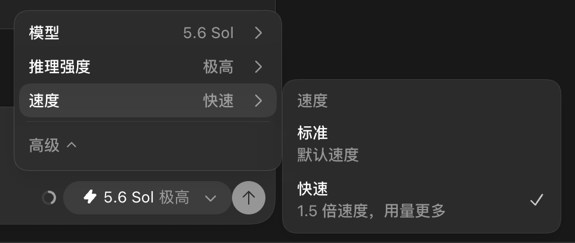

# ChatGPT App 本地功能补丁工具

[English](README.md)

该工具用于安全管理两个本地补丁，专门解决使用 API key 登录 Codex 时可能遇到的两个问题：

1. **新模型及时显示：** 解决新模型发布后，使用 API key 登录 Codex 时模型菜单更新不及时的问题。provider 返回的模型只要标记为 `visibility=list`，就可以自动进入模型菜单，无需写死任何 GPT 模型 ID。
2. **强制支持 Fast 模式切换：** 解决使用 API key 登录 Codex 时无法看到 Fast mode 菜单的问题。当所选模型声明支持相应 service tier 时，补丁会强制显示标准/Fast（Priority）切换选项。

> [!WARNING]
> 本项目会修改本机安装的第三方桌面应用。每次实际写入前都会创建经过哈希验证的备份，但补丁后的 macOS App 必须使用本地 ad-hoc 签名，因此 Gatekeeper 不会再将其视为 OpenAI 官方发行版。

## 功能截图

| 新模型及时进入模型菜单 | 强制支持 Fast 模式切换 |
| --- | --- |
|  |  |

两张图片均截取自本机已验证的 API key 登录状态。左图展示补丁根据 provider 返回的 `visibility` 及时显示新模型，不维护固定模型白名单；右图展示在相同 API key 登录模式下可用的标准/Fast 切换。图片中不包含账号、提示词或工作区信息。

## 环境要求

- Node.js 20 或更高版本。
- 已验证流程使用 macOS 和 `/Applications/ChatGPT.app`。
- Windows 支持仍为实验性且尚未实测；安装路径无法自动识别时可使用 `--app` 或 `--resources`。

## 交互式使用

在 Terminal 中进入本目录并运行：

```bash
node ./scripts/chatgpt_app_feature_patcher.mjs
```

脚本会显示 App 版本、签名以及两个功能的当前状态，然后提供：

```text
1. 添加功能 1
2. 添加功能 2
3. 添加全部功能
4. 改为默认值
q. 退出
```

修改 App 前还需要输入 `y` 确认。正常 macOS 运行时，脚本会退出 App、完成补丁和验证，然后重新启动 App。

## 官方 App 更新后

官方更新会覆盖本地补丁。更新完成后重新运行同一个脚本，通常选择 `3. 添加全部功能`。

脚本不按 App 版本分支，也不写死 App 版本。它根据 Electron Pickle 长度字段和四字节对齐规则解析 ASAR header，动态扫描 `webview/assets/*.js`，并要求每个已知表达式只能唯一命中。如果上游重写了前端逻辑，脚本会显示“无法识别”并拒绝猜测性修改。

如果旧版 Fast 补丁显示“旧版补丁（需修复）”，选择功能 2 或全部功能即可迁移，同时保留功能 1。

## 备份、默认值与精确回滚

- 每次实际修改 App 前，工具都会将 `app.asar`、`Info.plist`、主程序和 `CodeResources` 备份到 `outputs/patches/<timestamp>-<action>/`。
- `manifest.json` 会记录 SHA-256、文件权限、签名输出、功能状态和精确回滚命令。
- `4. 改为默认值` 会优先使用相同 App 版本和 bundle version 的已验证官方备份，恢复原始文件和 OpenAI 签名。
- `node ./scripts/restore_chatgpt_app.mjs` 是相同默认值恢复流程的兼容入口。
- 为避免跨版本破坏，回滚 manifest 不允许应用到其他 App 版本。

## Fast 的含义

API key 模式下的 Fast 使用模型目录声明的服务层。当前观测到的模型目录将其映射为 `service_tier=priority`。

- 按 API Priority 处理费率计费。
- 不消耗 ChatGPT 套餐中的 Fast credits。
- 默认不会自动开启，必须由用户选择。
- 选择“标准”可恢复默认 API 处理层级。

## 只读与非交互命令

```bash
# 只显示当前状态，不修改文件
node ./scripts/chatgpt_app_feature_patcher.mjs --status

# 构建并验证拟执行修改，但不写入文件
node ./scripts/chatgpt_app_feature_patcher.mjs --set all --dry-run

# 非交互添加全部功能
node ./scripts/chatgpt_app_feature_patcher.mjs --set all --yes
```

每次官方更新后，请先运行 `--status` 或 `--dry-run`。

## 完整性与代码签名

补丁采用等长修改。对于每个被修改的 asset，工具会更新并验证：

- asset SHA-256；
- 全部 ASAR block hashes；
- ASAR header hash；
- `Info.plist` 中的 `ElectronAsarIntegrity`；
- 本地 ad-hoc 重签后的 macOS deep/strict 代码签名有效性。

macOS 补丁完成后，`codesign --verify --deep --strict` 应通过。由于本地 ad-hoc 签名不是 OpenAI 公证发行版，`spctl` 通常会显示 `rejected`。请勿分发补丁后的 App 或任何提取出的专有 App 文件。

在实验性 Windows 流程中，修改 Electron integrity fuse 会使可执行文件签名失效。请保留生成的 manifest，并使用其中的回滚命令恢复原始可执行文件。

## 安全策略与漏洞报告

报告问题前，请先使用最近一次 manifest 备份回滚，并确认官方 App 本身能否正常运行。

请勿在公开 Issue、截图或日志中提交：

- API key、访问令牌、Cookie 或认证请求头；
- 账号标识、邮箱地址、提示词或私有工作区名称；
- 专有 ASAR 内容、提取出的源码 bundle 或完整 App 二进制文件；
- 未脱敏的 manifest，或包含敏感本机用户路径的命令输出。

只需提供 App 版本、操作系统、移除敏感信息后的补丁工具输出，以及最小必要代码片段。私密联系方式公布后，安全问题应通过维护者提供的私密渠道报告；在此之前，请勿公开可利用的漏洞细节。

## 许可证

本仓库中的补丁脚本采用 [MIT License](LICENSE)。OpenAI App 文件和商标不包含在该许可证范围内。
